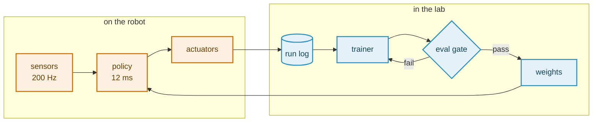

# The <span class="sc-gradient">Deep End</span>

A slide is a web page. This deck is the argument for taking that literally —
live figures, runnable code, and a robot arm that follows your mouse, all of it
in the same Palatino and the same orange as every other deck in the lab.

<!--
This is the third example deck in the repo. The other two are the ones to copy
when you have a meeting on Monday:

    ./present weekly-update     a weekly update
    ./present talk              a conference or job talk
    ./present showcase          this one

This one exists to show what is possible, not to be copied wholesale. Take the
slide you want, take the component under it, leave the rest.

Everything here runs on the same pinned Slidev in the same container as the
other decks. No extra packages were installed to build any of it, which is
deliberate: a deck that needs `npm install` to open is a deck that will not
open on somebody else's laptop.

Press `o` to see every slide at once, `f` for fullscreen. What you are reading
is a speaker note; the audience never sees it.
-->

---
layout: demo
feature: "Links & route aliases"
syntax: "<Link to=\"...\"> · routeAlias:"
grid: true
hideInToc: true
transition: slide-left
---

## Six Things a PDF Cannot Do

<div class="sc-index sc-index--3 mt-2">
<Link to="motion"><div class="sc-index__card"><div class="sc-index__n">01</div><div class="sc-index__t">Motion</div><div class="sc-index__d">Clicks, springs, and a transition of your own.</div></div></Link>
<Link to="code"><div class="sc-index__card"><div class="sc-index__n">02</div><div class="sc-index__t">Code</div><div class="sc-index__d">Code that morphs, types itself, and runs.</div></div></Link>
<Link to="data"><div class="sc-index__card"><div class="sc-index__n">03</div><div class="sc-index__t">Data</div><div class="sc-index__d">Charts you hover, tables you re-sort.</div></div></Link>
<Link to="math"><div class="sc-index__card"><div class="sc-index__n">04</div><div class="sc-index__t">Diagrams</div><div class="sc-index__d">Mermaid, KaTeX, arrows, annotations.</div></div></Link>
<Link to="interactive"><div class="sc-index__card"><div class="sc-index__n">05</div><div class="sc-index__t">Interactive</div><div class="sc-index__d">An arm solving IK, three optimisers arguing.</div></div></Link>
<Link to="structure"><div class="sc-index__card"><div class="sc-index__n">06</div><div class="sc-index__t">Structure</div><div class="sc-index__d">Globals, layers, imported slides, notes.</div></div></Link>
</div>

<p class="sc-hint">Each card links to a slide's <code>routeAlias</code> rather than its number, so the deck survives being reordered.</p>

<!--
`<Link to="motion">` does not point at a slide number — it points at a name.
The target slide says `routeAlias: motion` in its frontmatter, and after that
you can insert ten slides in front of it without breaking the link.

This is also how you build a "jump back to the agenda" affordance: give the
agenda slide a routeAlias and link to it from a corner of every section.
-->

---
layout: chapter
n: "01"
sub: "Everything on a slide can arrive, move and leave — and all of it is driven by the same click counter."
routeAlias: motion
hideNumber: true
transition: sc-wipe
---

# Motion

<!--
The transition onto this slide is `sc-wipe`, which is not a Slidev built-in —
it is a block of CSS in `styles/index.css`. Slidev wraps every slide in a Vue
<Transition> named after the frontmatter value, so defining the six classes
`.sc-wipe-enter-from`, `-enter-active`, `-enter-to` and the matching `-leave-`
trio is the whole of it. Nothing needs registering.

There is a second set named `sc-wipe-backward`, because Slidev looks for that
when you navigate back through a slide and does nothing at all if it is
missing.

Built-in names, if you do not want to write one: fade, fade-out, slide-left,
slide-right, slide-up, slide-down, view-transition.
-->

---
layout: demo
feature: "Click animations"
syntax: "v-click · v-after · $clicks"
clicks: 5
grid: true
transition: slide-left
---

## One Counter, Five Behaviours

<TwoColumn ratio="1.5fr 1fr" gap="2.4rem">

<div class="sc-stack">
<div class="sc-card sc-rise" v-click><b>v-click</b> — appears on the next click, in markup order. Nothing to number.</div>
<div class="sc-card sc-rise" v-after><b>v-after</b> — rides along with the one above it, on the same click.</div>
<div class="sc-card sc-rise" v-click="[3, 5]"><b>v-click="[3, 5]"</b> — in at three, gone again at five.</div>
<div class="sc-card sc-rise" v-click="4"><b>v-click="4"</b> — pinned to a click, wherever it sits in the file.</div>
<div class="sc-card sc-zoom" v-click.hide="4"><b>v-click.hide="4"</b> — visible until four, then out of the way.</div>
</div>

<template #right>

<div class="sc-ring">
<svg viewBox="0 0 120 120"><circle cx="60" cy="60" r="50" fill="none" stroke="#ececef" stroke-width="9" /><circle cx="60" cy="60" r="50" fill="none" stroke="#cc7000" stroke-width="9" stroke-linecap="round" pathLength="1" stroke-dasharray="1" :stroke-dashoffset="1 - $clicks / 5" transform="rotate(-90 60 60)" style="transition: stroke-dashoffset 0.4s cubic-bezier(0.22, 1, 0.36, 1)" /><text x="60" y="68" text-anchor="middle" class="sc-ring__num">{{ $clicks }}</text></svg>
<div class="sc-ring__label">$clicks of 5</div>
</div>

</template>
</TwoColumn>

<!--
`$clicks` is a template global: no import, usable in any expression on the
slide. The ring on the right is one SVG circle whose dash offset is
`1 - $clicks / 5`, which is all an animated progress ring has ever been.

`clicks: 5` in this slide's frontmatter fixes the total. Slidev counts clicks
from the v-click directives it can see; a slide that animates from `$clicks` in
an expression has to say how far it goes.

The smoothing on these cards is not Slidev's: `sc-rise` and `sc-zoom` in
styles/index.css slow the default ~100ms fade to something that reads as motion
rather than as a flicker.
-->

---
layout: demo
feature: "v-motion"
syntax: ":initial :enter :click-1 :leave"
grid: true
clicks: 2
transition: slide-left
---

## Springs, Not Fades

<div class="sc-grid-3 mt-2">
<div class="sc-card" v-motion :initial="{ x: -70, opacity: 0 }" :enter="{ x: 0, opacity: 1, transition: { delay: 120, duration: 600 } }" :click-1="{ y: -14, scale: 1.04 }"><div class="sc-card__title">From the left</div><div class="sc-card__body">Arrives on slide entry, lifts on the first click.</div></div>
<div class="sc-card" v-motion :initial="{ y: 70, opacity: 0 }" :enter="{ y: 0, opacity: 1, transition: { delay: 260, duration: 600 } }" :click-2="{ rotate: -3, scale: 1.04 }"><div class="sc-card__title">From below</div><div class="sc-card__body">Same arrival, a beat later, tilts on the second.</div></div>
<div class="sc-card" v-motion :initial="{ x: 70, opacity: 0 }" :enter="{ x: 0, opacity: 1, transition: { delay: 400, duration: 600 } }" :leave="{ x: 140, opacity: 0 }"><div class="sc-card__title">From the right</div><div class="sc-card__body">And leaves the way it came when the slide does.</div></div>
</div>

```html
<div v-motion
  :initial="{ x: -70, opacity: 0 }"
  :enter="{ x: 0, opacity: 1, transition: { delay: 120 } }"
  :click-1="{ y: -14, scale: 1.04 }" />
```

<!--
`v-motion` is @vueuse/motion, which ships inside Slidev. `:initial` is where
the element starts, `:enter` where it settles, `:click-N` where it goes on the
Nth click of this slide, and `:leave` where it goes as the slide exits.

Staggering by delay is the trick worth stealing: three cards that arrive
together read as one object, three cards 140ms apart read as three.
-->

---
layout: demo
feature: "Inline components"
syntax: "<Marker :show=\"$clicks > 0\">"
clicks: 3
transition: slide-left
---

## Emphasis That Happens Live

<div class="mt-2 text-[1.45rem] leading-[1.9]">

A deck is <Marker :show="$clicks > 0">a running application</Marker>, which is
why the thing you are looking at can change while you talk about it. Emphasis
that was always on the slide gets skimmed with everything else; emphasis that
<Marker kind="highlight" color="#8d5fd3" :show="$clicks > 1">lands while you are saying the words</Marker>
gets read. The version of this slide that <Marker kind="strike" :show="$clicks > 2">bolded all three phrases up front</Marker>
said the same thing and nobody noticed.

</div>

<div class="sc-note mt-6" v-click="3">

`Marker` is one SVG path in `components/Marker.vue`, stretched over whatever it
wraps and animated with `pathLength="1"` — so a two-word phrase and a whole
line of text run the same four lines of code.

</div>

<!--
Three kinds: underline, highlight, strike. The strike one is the useful one in
a talk — it is how you rule something out in front of people instead of just
not mentioning it.
-->

---
layout: chapter
n: "02"
sub: "Code on a slide can morph between versions, type itself out, and be edited and run in front of the room."
routeAlias: code
hideNumber: true
transition: sc-wipe
---

# Code

---
layout: demo
feature: "Magic Move"
syntax: "```md magic-move"
transition: slide-left
---

## Code That Rewrites Itself

````md magic-move {lines: true}
```js
// one seed, one configuration
const result = run({ seed: 0, lr: 3e-4 })
```

```js
// every seed
const results = seeds.map((seed) => run({ seed, lr: 3e-4 }))
```

```js
// every seed, every rate
const results = sweep({ seed: seeds, lr: [1e-4, 3e-4, 1e-3] })
  .map(run)
```

```js
// every seed, every rate, and only the runs that finished
const results = sweep({ seed: seeds, lr: [1e-4, 3e-4, 1e-3] })
  .map(run)
  .filter((r) => r.status === 'done')

report(results)
```
````

<p class="sc-hint">Four code blocks inside one <code>magic-move</code> fence. Shiki tokenises each, matches the tokens, and animates the ones that moved.</p>

<!--
This is the feature to show someone who thinks Slidev is just markdown. The
alternative — four slides with four nearly-identical code blocks — makes the
audience diff them by eye. Here the diff is the animation.

Two rules. Use one more backtick for the outer fence than the inner blocks
(four outside, three inside). And keep the steps genuinely related: magic-move
between two unrelated functions is a mess of tokens flying across the slide.
-->

---
layout: demo
feature: "Line highlighting & imports"
class: sc-cols-top
syntax: "{1|3-6|all} · <<< @/snippets/"
transition: slide-left
---

## Walking Through Code

<TwoColumn ratio="1fr 1fr" gap="1.6rem">

```js {1|2-3|4-6|all}{lines:true}
export function cosineSchedule(step, opts) {
  const { total, warmup = 0, peak = 1e-3, floor = 0 } = opts
  if (step < warmup) return (peak * step) / warmup
  const t = (step - warmup) / (total - warmup)
  return floor + 0.5 * (peak - floor)
    * (1 + Math.cos(Math.PI * Math.min(t, 1)))
}
```

<template #right>

The ranges after the language — `{1|2-3|4-6|all}` — are click steps. Each one
dims everything it does not name, so a function can be walked through a line at
a time without ever cutting to a new slide.

The same block can come from a real file instead — `<<< @/snippets/schedule.js#cosine {3-5}`
on a line of its own.

`@` is the deck folder and `#cosine` is a `// #region` in the file, so the
slide and the repository cannot drift apart.

</template>
</TwoColumn>

<!--
The imported version of this exact function is on the next slide, pulled out of
snippets/schedule.js. If somebody edits the file, the slide changes. That is
the whole argument for `<<<` over pasting: there is only one copy.
-->

---
layout: demo
feature: "Code from a file"
syntax: "<<< @/snippets/schedule.js#sweep"
transition: slide-left
---

## The Same Code, From Disk

<<< @/snippets/schedule.js#sweep {3-7}

<p class="sc-hint">That block is not in this markdown file. It is <code>snippets/schedule.js</code>, region <code>sweep</code>, read at build time.</p>

<div class="sc-note mt-3">

Worth knowing for a code walkthrough: point `<<<` at the file you are actually
going to open in the editor afterwards. The slide then cannot be out of date
with what you show, which is the single most common way a live demo goes wrong.

</div>

---
layout: demo
feature: "Components + $renderContext"
syntax: ":step=\"$clicks\" :typing=\"...\""
clicks: 7
transition: slide-left
---

## A Terminal That Types

<div>
<Terminal
  title="~/slides"
  :rows="9"
  :step="$clicks"
  :typing="$renderContext !== 'print'"
  :lines="[
    ['cmd', './present showcase'],
    ['dim', 'serving examples/showcase'],
    ['out', '  deck       http://localhost:3030/'],
    ['out', '  presenter  http://localhost:3030/presenter'],
    ['ok',  'ready in 1.4s'],
    ['cmd', 'docker compose -f compose.slidev.yml run --rm export showcase'],
    ['dim', 'rendering 1 deck(s) -> /repo/build'],
    ['ok',  '  examples/showcase                  ok    34 pages   44s'],
  ]" />
</div>

<p class="sc-hint">Each click adds a line, and command lines type themselves — except under the PDF exporter, where <code>$renderContext</code> is <code>print</code> and the typewriter would be caught mid-word.</p>

<!--
Two globals, no imports. `$clicks` decides how much of the transcript is
visible; `$renderContext` tells the component whether it is being rendered for
a screen or for a PDF.

This is the pattern to copy for any animated component: the markdown decides
*when*, the component only knows *how*. Keeping Slidev out of the component is
what makes it reusable in a deck that drives it differently.
-->

---
layout: demo
feature: "Interactive component"
syntax: "new Function(...) in a slide"
transition: slide-left
---

## Code That Runs

<CodePlayground class="mt-1" />

<p class="sc-hint">Edit anything and press Run, or ⌘↵ / Ctrl↵. A returned array of numbers gets drawn.</p>

<!--
The honest reason this matters: when someone asks "what if the schedule were
linear?", you change the line and press Run. The alternative is promising a
plot by Friday, and by Friday the question has moved on.

Keyboard events are stopped at the textarea, because Slidev listens on the
document for the arrow keys — without that, typing a comma would advance the
slide. If you write your own editable component, copy that bit.
-->

---
layout: chapter
n: "03"
sub: "Figures that answer the question that gets asked, rather than the one you prepared for."
routeAlias: data
hideNumber: true
transition: sc-wipe
---

# Data

---
layout: demo
feature: "SVG charts, no library"
syntax: "common/collab/components/LiveChart.vue"
clicks: 2
transition: slide-left
---

## Curves That Arrive in Order

<TwoColumn ratio="1.45fr 1fr" gap="1.6rem">

<div>
<LiveChart
  unit="%"
  x-unit="k"
  :height="235"
  x-label="training steps"
  :reveal="$clicks + 1"
  :animate="$renderContext !== 'print'"
  :x="[0,2,4,6,8,10,12,14,16,18,20,22,24,26,28,30,32,34,36,38,40,42,44,46,48]"
  :series="[
    { name: 'ours', color: '#cc7000',
      data: [0,9.7,19.8,26.4,34.3,39.8,44.3,49.7,52.5,56.8,58.9,61.5,64.4,67.2,67.3,69,71.1,72.9,73,73.4,75.4,74,76.3,75.5,75.6],
      sem: [0,3.1,3.4,3.2,3,2.8,2.7,2.6,2.5,2.4,2.4,2.3,2.2,2.2,2.1,2.1,2,2,1.9,1.9,1.8,1.8,1.8,1.7,1.7] },
    { name: 'ablation', color: '#8d5fd3',
      data: [1.2,7.3,15.3,22.5,26.7,32.5,35.8,41.2,42.4,42.8,46,48.8,54.8,56.4,58,59.2,61.3,62.7,62.6,63.9,63.2,65.4,65.9,67.2,67.3],
      sem: [0.5,2.7,3,3.1,3,2.9,2.9,2.8,2.8,2.7,2.7,2.6,2.6,2.5,2.5,2.4,2.4,2.3,2.3,2.3,2.2,2.2,2.1,2.1,2.1] },
    { name: 'baseline', color: '#2a8fbd',
      data: [0,5.8,13,16.3,22,26.3,29.3,33.1,34.7,37.4,40.2,43.7,44.9,46.3,48.6,49.7,50.5,53,53.7,53.4,55.1,55.7,57.3,57.5,56.8],
      sem: [0,2.2,2.5,2.6,2.6,2.5,2.5,2.4,2.4,2.3,2.3,2.2,2.2,2.2,2.1,2.1,2,2,2,1.9,1.9,1.9,1.8,1.8,1.8] },
  ]" />
</div>

<template #right>

### Hover it

The crosshair reads out every visible series at that step, mean and SEM
together. Nobody has to squint at a legend and guess which line was which at
30k, or eyeball whether two clouds overlap.

### One click, one claim

- <span class="text-orange font-bold">ours</span> — what you are arguing for
- <span class="text-purple font-bold">ablation</span> — the part that mattered
- <span class="text-blue font-bold">baseline</span> — what you beat

Revealing them in that order means each curve lands while you are making the
claim it supports.

</template>
</TwoColumn>

<!--
`:reveal="$clicks + 1"` is the whole of the staging: the component draws the
first N series and the click counter picks N.

The lines draw themselves in with `pathLength="1"`, an SVG attribute that
renormalises a path to unit length — so one dash animation works for a curve of
nine points and one of nine hundred, with nothing measured.
-->

---
layout: demo
feature: "fetch() on a slide"
syntax: "components/RunsFromFile.vue"
clicks: 2
transition: slide-left
---

## The Figure Is the Results File

<div class="grid grid-cols-[1.35fr_1fr] gap-6 items-center">
<div>

<RunsFromFile
  src="/runs.csv"
  x-label="Hours of Interaction Data"
  y-label="Success Rate (%)"
  unit="%"
  :min="10" :max="85"
  :dashed="['oracle']"
  :reveal="$clicks + 1"
  :animate="$renderContext !== 'print'" />

</div>
<div>

```text
hours,ours,ours_sem,baseline,...
0,21.4,3.1,19.8,2.9,74.0
0.5,34.9,3.4,24.1,3.0,74.0
1,46.2,3.0,29.6,3.3,74.0
```

<p class="sc-hint mt-2">A slide can <code>fetch</code>. This one reads <code>public/runs.csv</code> at render time and hands the columns to <code>&lt;LiveChart&gt;</code> — so re-running the experiment and overwriting one file updates the talk.</p>

</div>
</div>

<!--
The usual path is: run, plot, export a PNG, drag it into the slides, notice the
axis is wrong, and go round again. Every loop is a chance for the number on the
slide to stop matching the number in the paper.

This is the same figure with the loop removed. `public/runs.csv` is whatever
the training script writes; the component fetches it, parses it, and passes the
columns straight to the theme's chart. A column called `ours_sem` becomes the
band around `ours` — the convention is in the component's header comment.

It works in the PDF export too, because the exporter drives a real browser
against the dev server: the printed figure is read from the same file at print
time.

The parser is twenty lines and refuses to guess. That is deliberate. A CSV
parser clever enough to infer types is a CSV parser that will one day quietly
drop a column of results, and you will present it.
-->

---
layout: demo
feature: "Animated counters"
syntax: "components/StatCard.vue"
grid: true
clicks: 1
transition: slide-left
---

## Numbers That Land

<div class="sc-grid-4 mt-2">
<StatCard :value="75.6" unit="%" :decimals="1" label="success rate" :delta="18.8" delta-unit=" pts" :spark="[34.3,44.3,52.5,58.9,64.4,71.1,75.6]" :animate="$renderContext !== 'print'" />
<StatCard :value="3.2" unit=" h" :decimals="1" label="median run" :delta="-0.8" delta-unit=" h" good="down" accent="var(--sc-blue)" :spark="[5.1,4.6,4.4,3.9,3.5,3.3,3.2]" :animate="$renderContext !== 'print'" />
<StatCard :value="48" label="seeds finished" :delta="12" accent="var(--sc-purple)" :spark="[8,16,24,30,36,42,48]" :animate="$renderContext !== 'print'" />
<StatCard :value="2" label="open blockers" :delta="-3" good="down" accent="var(--sc-green)" :animate="$renderContext !== 'print'" />
</div>

<div class="mt-6 text-[1.15rem]" v-click>

A number that counts up gets looked at. A number that is simply there gets
skimmed with the rest of the slide — which is the same argument as
<Marker :show="$clicks > 0">the one about emphasis</Marker>, and the reason both
of these are worth building once and reusing.

</div>

<!--
The count-up runs once, when the card first becomes visible, and not at all
under `prefers-reduced-motion` or during export. A print has no arrival to
animate, and someone who has asked their machine to stop moving things has
asked you too.
-->

---
layout: demo
feature: "Stateful components"
syntax: "components/SortableTable.vue"
transition: slide-left
---

## Sort It From the Stage

<div class="mt-1">
<SortableTable
  sort="success"
  highlight="ours (full)"
  :columns="[
    { key: 'method', label: 'method' },
    { key: 'success', label: 'success', unit: '%', decimals: 1, bar: true },
    { key: 'ood', label: 'held-out', unit: '%', decimals: 1, bar: true, color: 'var(--sc-purple)' },
    { key: 'wall', label: 'wall-clock', unit: ' h', decimals: 1 },
    { key: 'params', label: 'params', unit: ' M', decimals: 0 },
  ]"
  :rows="[
    { method: 'ours (full)', success: 75.6, ood: 61.2, wall: 3.2, params: 84 },
    { method: 'ours, no reweighting', success: 67.3, ood: 49.8, wall: 3.0, params: 84 },
    { method: 'baseline', success: 56.8, ood: 38.4, wall: 2.1, params: 82 },
    { method: 'baseline + tuning', success: 61.9, ood: 41.0, wall: 9.4, params: 82 },
    { method: 'prior work', success: 58.2, ood: 44.6, wall: 5.7, params: 310 },
  ]" />
</div>

<p class="sc-hint">Click a column heading. Rows move rather than jump, so the re-sort is legible.</p>

<div class="sc-note mt-3">

The question this is for is "yes, but which is fastest?", asked from the third
row, about a table you sorted by accuracy. Sorting it live takes a second and
ends the exchange.

</div>

---
layout: chapter
n: "04"
sub: "Diagrams from text, mathematics from LaTeX, and annotations you position by dragging them."
routeAlias: math
hideNumber: true
transition: sc-wipe
---

# Diagrams & Math

---
layout: demo
feature: "Mermaid"
syntax: "```mermaid {theme, scale}"
transition: slide-left
---

## A Diagram From Text



<p class="sc-hint">Eleven lines of text. Rearranging the pipeline is editing a sentence, not moving boxes around in Illustrator.</p>

<!--
`classDef` is how a Mermaid diagram gets the deck's palette instead of
Mermaid's. Two definitions, two `class` lines, and the figure belongs to the
same talk as the text next to it.

The version of this figure drawn by hand in a vector editor took forty minutes
and was wrong within a week, because the pipeline changed and nobody wanted to
open the file again.
-->

---
layout: demo
feature: "KaTeX + theme classes"
syntax: "$$...$$ · .kset-frame"
clicks: 3
transition: slide-left
---

## Boxing the Terms

<div class="kset-wrap mt-2">
<div class="kset-frame is-outer" data-label="what the estimator computes" v-click="3"></div>
<div class="kset-row">
<div class="kset-cell is-narrow">
<div class="kset-frame" data-label="importance weights" v-click="1"></div>
<div class="kset-eq is-compact">

$$w_i = \frac{p(x_i)}{q(x_i)}$$

</div>
</div>
<div class="kset-cell is-wide">
<div class="kset-frame" data-label="what the sample says" v-click="2"></div>
<div class="kset-eq is-compact">

$$\hat{\theta} = \frac{1}{n}\sum_{i=1}^{n} w_i \, f(x_i)$$

</div>
</div>
</div>
</div>

<Takeaway>Bias vanishes once the sampling weights are known.</Takeaway>

<p class="sc-hint">Those frames are <code>.kset-frame</code> from <code>common/collab</code> — the talk theme already ships them, and a <code>v-click</code> on each one reveals them in reading order.</p>

<!--
Nothing new was written for this slide. The labelled boxes are theme CSS that
already existed for a different talk; the only addition is the `v-click` on
each frame, which is what turns a static figure into three sentences.

Before writing a component, check `common/collab/styles/index.css`. It is
longer than it looks and most of it is reusable.
-->

---
layout: demo
feature: "Magic Move, for maths"
syntax: "<MathMove :step=\"$clicks\">"
clicks: 4
transition: slide-left
---

## Where Did That Term Come From?

<MathMove :step="$clicks" :animate="$renderContext !== 'print'" :min-height="140" size="1.3em">

<div>

$$ \log p(x) = \log \int p(x, z) \, dz $$

</div>

<div>

$$ \log p(x) = \log \int q(z) \, \frac{p(x, z)}{q(z)} \, dz $$

</div>

<div>

$$ \log p(x) = \log \mathbb{E}_{q(z)}\!\left[ \frac{p(x, z)}{q(z)} \right] $$

</div>

<div>

$$ \log p(x) \ge \mathbb{E}_{q(z)}\!\left[ \log \frac{p(x, z)}{q(z)} \right] $$

</div>

<div>

$$ \log p(x) \ge \mathbb{E}_{q(z)}\bigl[ \log p(x, z) \bigr] - \mathbb{E}_{q(z)}\bigl[ \log q(z) \bigr] $$

</div>

</MathMove>

<div class="mm-caption h-[2.6rem] mt-3">

<div class="mm-cap" :class="$clicks === 0 ? 'is-on' : ''">

The evidence, which is the integral nobody can do.

</div>

<div class="mm-cap" :class="$clicks === 1 ? 'is-on' : ''">

Multiply by one — $q(z)/q(z)$ — for any $q$ we can actually sample.

</div>

<div class="mm-cap" :class="$clicks === 2 ? 'is-on' : ''">

Which is an expectation under $q$. Watch the ratio travel: it arrives whole.

</div>

<div class="mm-cap" :class="$clicks === 3 ? 'is-on' : ''">

Jensen's inequality moves the $\log$ inside, and costs us the equals sign.

</div>

<div class="mm-cap" :class="$clicks === 4 ? 'is-on' : ''">

The ELBO — and the ratio splits into the two terms we can actually estimate.

</div>

</div>

<p class="sc-hint">Slidev ships <code>magic-move</code> for code and nothing for maths. <code>&lt;MathMove&gt;</code> is the same idea over KaTeX: matching runs of glyphs, one shared flight per run.</p>

<!--
Five steps of the ELBO, which is the derivation everybody has seen and nobody
has watched. The claim the component makes is in step 2: `p(x,z)/q(z)` starts
its life inside an integral and ends up inside an expectation, and it travels
there as one object rather than as eleven characters going their own ways.

That is the design rule, and it is the opposite of what you would write first.
The obvious implementation matches glyph to glyph and moves each the shortest
distance, which shatters every term — `p` finds a nearer `p`, the fraction bar
finds a different bar, and the audience watches a snowstorm. Matching whole
runs and letting them cross is worse by the metric and far better on the
screen.

Set `clicks:` in the frontmatter to one less than the number of children: the
bare slide is step 0.

Three classes come with the component for the shape this slide has — `.mm-lead`
for a framing sentence that rises out of the way, `.mm-reveal` for a fade-in,
and `.mm-caption`, the fixed-height box under the stage holding one `.mm-cap`
per step so the commentary changes without the layout moving.
-->

---
layout: demo
feature: "Arrow & draggable elements"
syntax: "double-click to move · <Arrow />"
clicks: 1
transition: slide-left
---

## Annotations You Drag Into Place

<div class="w-[50%]">
<FigureCaption src="/assets/example.png" caption="The figure this slide is about." />
</div>

<div v-drag="[551,243,320,96]" class="sc-callout"><strong>Double-click this box</strong> to put it into edit mode — a frame with handles appears. Then drag it, resize it, or rotate it, and click away when you are done. Single-clicking does nothing, which is the whole trick people miss.</div>

<v-drag pos="560,133,320,86">
<div class="sc-callout"><strong>Same thing as a tag.</strong> The directive above and this component are two spellings of one feature; use whichever reads better where you are.</div>
</v-drag>

<div class="sc-callout sc-callout--plain" v-click="1" style="position: absolute; left: 540px; top: 372px; width: 320px"><strong>&lt;Arrow&gt;</strong> — a plain component taking x1, y1, x2, y2 in slide coordinates. This deck is 980 &times; 551, so the numbers are readable by hand.</div>

<Arrow v-click="1" x1="532" y1="400" x2="420" y2="330" color="#cc7000" width="2" />

<!--
Double-click, not click. A draggable element sits still under an ordinary
click so that it can hold a link or a button like any other element; a
double-click is what puts it into edit mode, and then the frame with the
handles appears. Click outside or press Escape to leave.

Once you have moved it, the four numbers in slides.md have changed — the file
on disk is rewritten as you drag. That only happens on the dev server, which is
the right place for it: an export renders whatever the file says, so the deck
stays reproducible.

Two spellings, same feature: the directive on any element, or the component
wrapped around anything. The third box is neither — it is an ordinary
absolutely-positioned div, which is what you want when the position is not
something you will ever want to nudge by hand.

A caveat that will bite somebody: the plugin behind the draggable elements
scans a slide's rendered text for the directive's name, not just its
attributes, and needs the token's source line to write back to. Writing that
name as running text inside a markdown table crashes the build, because inline
tokens in a table cell carry no source map. Name it outside a table.

If the arrow is pointing somewhere silly on your screen, that is the exercise —
move the boxes, then adjust the four numbers on the Arrow to match.
-->

---
layout: chapter
n: "05"
sub: "Two demos that are not recordings. The arm follows your pointer; the optimiser runs when you press Run."
routeAlias: interactive
hideNumber: true
transition: sc-wipe
---

# Interactive

---
layout: full
dark: true
title: "Inverse kinematics"
caption: "Move the pointer — or leave it alone and the arm drives itself."
hideNumber: true
hideInToc: true
transition: slide-left
---

<RobotArm />

<!--
Closed-form two-link IK: law of cosines for the elbow, one atan2 for the
shoulder, and the joint angles eased towards the solution at a fixed rate per
second so it moves like a machine rather than snapping like a cursor.

Leave it alone for two seconds and it takes itself for a walk along a Lissajous
figure, which matters more than it sounds: the slide has to look alive from the
back of the room before anyone asks you to prove that it is.

The sliders change the link lengths, which changes the reachable annulus — the
two dashed circles. Drive the pointer outside the outer one and the readout
says "out of reach" while the arm points at it as best it can. That is a better
explanation of workspace limits than a paragraph about workspace limits.
-->

---
layout: demo
feature: "Live simulation"
syntax: "components/OptimizerLab.vue"
transition: slide-left
---

## Three Optimisers, One Surface

<OptimizerLab class="mt-1" />

<!--
Himmelblau's function: four minima, all the same depth. Click somewhere on the
surface to move the start, pick an optimiser, press Run. Which minimum it finds
is decided entirely by where it started — which is the point worth making out
loud, and one a still figure cannot make at all.

Things to do with it in front of an audience:

  * Take the rate up two notches on SGD and watch it diverge.
  * Set momentum to 0.95 and watch it overshoot the basin and come back.
  * Start on the ridge between two minima and run it twice from either side.

The surface is computed once per resize into an offscreen canvas and blitted
each frame; only the trajectory is redrawn. That is what keeps a live demo from
turning the projector's fans on halfway through your talk.
-->

---
layout: demo
feature: "3D, without a 3D library"
syntax: "components/Landscape3D.vue"
transition: slide-left
---

## The Same Surface, Standing Up

<Landscape3D />

<!--
The previous slide drew Himmelblau's function as contours and asked which
minimum a run would find. This one asks the question contours cannot answer:
how high is the wall between them?

No three.js, no WebGL, no shader. Three dimensions on a 2D canvas is four
things, and only the last is subtle:

  1. a mesh — the height sampled on a grid;
  2. a rotation — yaw and pitch, six multiplies a vertex;
  3. a projection — drop the depth coordinate;
  4. an order — draw far things before near ones.

Step 4 is the painter's algorithm and it is six lines. Every quad *and* every
segment of the descent path goes into one list tagged with the depth of its
centre; the list is sorted once per frame; then it is drawn. That is why the
trajectory vanishes behind a ridge and comes back, instead of floating over the
top of the figure like an annotation.

Shading is one dot product against a fixed light. The colour ramp runs between
two of the theme's own colours, so the figure belongs to the talk.

Drag the surface while you are talking. A figure somebody in the third row can
ask you to rotate is a different kind of object from a PNG.
-->

---
layout: demo
feature: "Fixed-step physics"
syntax: "components/Chaos.vue · RK4"
transition: slide-left
---

## Two Pendulums, One Millionth of a Radian Apart

<Chaos />

<!--
The argument for this slide over a figure: a figure of two diverged
trajectories proves nothing, because the audience never saw them agree. Here
they watch the traces sit on top of each other, and then come apart. The claim
is made by the waiting.

Two things in the implementation are worth stealing.

The integrator runs at a *fixed* 1/480s step, several steps per frame, rather
than integrating whatever `dt` the browser handed over. A chaotic system fed a
wobbling step size diverges because the integrator wobbled — which is a
different phenomenon wearing the same costume. Four extra lines buy an honest
demo.

And it is RK4, not Euler. A double pendulum conserves energy; forward Euler
does not, and a minute into the talk both arms would be whirling like a fan,
which is a lie told at sixty frames a second.

The sparkline on the right is the real quantity: log of the angular separation,
which climbs in a straight line — that slope is the Lyapunov exponent — until
it saturates at the size of the system. Turn the nudge down to 1e-9 and the
straight line just starts lower and takes longer; it never gets shallower.
-->

---
layout: demo
feature: "CSS 3D"
syntax: "components/TiltCard.vue"
grid: true
clicks: 1
transition: slide-left
---

## Three Things Worth the Trouble

<div class="sc-grid-3 mt-3 h-[13rem]">
<TiltCard v-click="1" class="sc-rise sc-stagger" style="--i: 0" eyebrow="01" title="Hot reload" accent="var(--sc-orange)">Save the markdown; the slide changes. A reference you fix five minutes before the talk is live without restarting anything.</TiltCard>
<TiltCard v-click="1" class="sc-rise sc-stagger" style="--i: 1" eyebrow="02" title="One source" accent="var(--sc-blue)">The deck is text in git. Diffs are readable, review is normal, and two people can edit different slides without a merge ritual.</TiltCard>
<TiltCard v-click="1" class="sc-rise sc-stagger" style="--i: 2" eyebrow="03" title="It exports" accent="var(--sc-purple)">Everything here still renders to a PDF for the people who want one — the interactive parts freeze at a sensible frame.</TiltCard>
</div>

<p class="sc-hint">Three cards, one click, 70&nbsp;ms apart: same <code>v-click="1"</code> on each, and a <code>--i</code> that <code>.sc-stagger</code> turns into a transition delay.</p>

<p class="sc-hint">The lean itself is two CSS custom properties written by a pointer handler. No re-render, no library, no animation loop.</p>

---
layout: chapter
n: "06"
sub: "What holds a long deck together: globals, layers, imported files, and content only you can see."
routeAlias: structure
hideNumber: true
transition: sc-wipe
---

# Structure

---
layout: demo
feature: "Template globals"
syntax: "$page · $nav · $clicks · $frontmatter"
grid: true
clicks: 2
transition: slide-left
---

## The Deck Knows Where It Is

<div class="sc-grid-4 mt-2">
<div class="sc-card"><div class="sc-index__n">$page</div><div class="sc-card__title">{{ $page }}</div><div class="sc-card__body">This slide's number, as written by Slidev, not by you.</div></div>
<div class="sc-card"><div class="sc-index__n">$nav.total</div><div class="sc-card__title">{{ $nav.total }}</div><div class="sc-card__body">Slides in the deck. The rail along the top divides by it.</div></div>
<div class="sc-card"><div class="sc-index__n">$clicks</div><div class="sc-card__title">{{ $clicks }}</div><div class="sc-card__body">Clicks so far on this slide. Press space and watch.</div></div>
<div class="sc-card"><div class="sc-index__n">$renderContext</div><div class="sc-card__title">{{ $renderContext }}</div><div class="sc-card__body">Where this is being drawn: slide, presenter, or print.</div></div>
</div>

<div class="mt-6" v-click>

Any of them can go straight into an expression — `:reveal="$clicks + 1"`,
`:typing="$renderContext !== 'print'"` — which is how every animated component
in this deck is driven without importing anything from Slidev.

</div>

<div class="sc-note mt-4" v-click>

`$frontmatter` is this slide's own frontmatter, live: this one's layout is
**{{ $frontmatter.layout }}** and its feature badge says
**{{ $frontmatter.feature }}**.

</div>

<!--
Open /print or export the deck and the `$renderContext` card above says
`print`. That is not a trick — it is how the terminal and the charts know to
stop animating.
-->

---
layout: demo
feature: "RenderWhen & notes"
class: sc-cols-top
clicks: 2
syntax: "<RenderWhen context=\"presenter\">"
transition: slide-left
---

## Content Only You Can See

<TwoColumn ratio="1fr 1fr" gap="2rem">

<div>

Three places to put something the audience should not read:

- **Speaker notes** — an HTML comment at the end of a slide. They appear in
  `/presenter` and in `/notes-edit`, never on the slide.
- **`<RenderWhen>`** — real content, rendered only in the context you name:
  `presenter`, `print`, `slide`, `overview`.
- **`<Backup>`** — a whole slide, kept after the end of the talk and reached
  from the slide picker when the question comes.

</div>

<template #right>

<RenderWhen context="presenter">

<div class="sc-note">

**You are in the presenter window.** This box exists on the slide but is
rendered only here — a reminder, a number you always forget, the name of the
person who asked you for this talk.

</div>

</RenderWhen>

<RenderWhen context="slide">

<div class="sc-card"><div class="sc-card__title">This is the audience view</div><div class="sc-card__body">Open <code>/presenter</code> in another window and this box is replaced by one only the presenter sees. Same slide, same file.</div></div>

</RenderWhen>

<p class="sc-hint">A note can also be split by click: put <code>[click]</code> on a line in the notes and the presenter view highlights the right paragraph as you step.</p>

</template>
</TwoColumn>

<!--
[click] The presenter view highlights whichever paragraph of these notes
corresponds to the click you are on. Put a `[click]` marker at the start of a
line and everything after it belongs to the next step.

[click] Which means a long note stops being a wall of text you lose your place
in halfway through a slide — it becomes a script that follows you.

The three mechanisms differ in what they cost: notes are free, RenderWhen is
real markup you have to maintain, and a backup slide is a slide. Reach for them
in that order.
-->

---
layout: demo
feature: "Deck-local theme extension"
class: sc-cols-top
syntax: "components/ layouts/ styles/"
transition: slide-left
---

## Everything Here Is Just Files

<TwoColumn ratio="1.05fr 1fr" gap="1.8rem">

```text
examples/showcase/
├── slides.md
├── global-top.vue        the progress rail
├── components/           10 auto-imported .vue files
├── layouts/              hero, chapter, demo, full
├── styles/               loaded after the theme's own
├── composables/          shared animation-loop helper
├── snippets/             code pulled in by <<<
├── pages/appendix.md     slides imported by src:
└── public/assets/        images, served from /assets
```

<template #right>

Slidev looks in the deck folder first and falls back to the theme, so this deck
adds four layouts and ten components to `common/collab` **without changing a
line of it**. Nothing is registered anywhere; the files being there is the
registration.

- `components/*.vue` — auto-imported by filename
- `layouts/*.vue` — usable as `layout:` in frontmatter
- `styles/index.ts` — loaded after the theme's own styles
- `global-top.vue` — rendered above every slide

<div class="sc-note mt-3">

The theme already ships `global-bottom.vue` for page numbers. A file of the same
name here would replace it, so the rail uses the other layer.

</div>

</template>
</TwoColumn>

<!--
This is the slide to remember. Everything in this deck that is not stock Slidev
lives in one folder, and copying that folder next to a new slides.md brings all
of it along.

The rule for promoting something out of here and into `common/collab`: when the
third deck wants it. Two decks is a coincidence.
-->

---
layout: demo
feature: "Imported slides & ToC"
class: sc-cols-top
syntax: "src: ./pages/... · <Toc>"
grid: true
transition: slide-left
---

## Slides From Other Files

<TwoColumn ratio="1fr 1.15fr" gap="2rem">

<div>

```yaml
# a slide whose whole content is
# somebody else's file
src: ./pages/appendix.md
```

One slide of frontmatter pulls in a file of slides. The appendix at the end of
this deck is two slides that live in `pages/appendix.md` and could be shared by
every deck in the lab.

The contents list on the right is `<Toc>`: it reads the headings of the deck
itself, so it cannot go stale.

</div>

<template #right>

<div class="sc-toc">
<Toc :columns="2" :max-depth="1" mode="all" />
</div>

</template>
</TwoColumn>

<!--
`maxDepth="1"` keeps this to the six chapter dividers, which each use `#`.
Every other slide uses `##` and is skipped. `hideInToc: true` in a slide's
frontmatter takes it out regardless.

For a long talk, the useful pattern is a Toc slide with a routeAlias, and a
small `<Link>` back to it in the corner of each divider.
-->

---
layout: demo
feature: "Timing a deck, and playing it"
syntax: "dwell: · Shift+P · ./record"
transition: slide-left
---

## A Deck That Presents Itself

<div class="grid grid-cols-2 gap-6 mt-1">
<div>

**Press `Shift+P`.** The deck jumps to slide 1 and walks itself to the end, one
step every `dwell:` seconds, with a clock in the corner. `Shift+P` again stops
it.

That is `<DeckPlayer />`, which the theme mounts in its own `global-top.vue` —
so every deck has it already. This deck writes its own `global-top` for the
progress rail up there, which *replaces* the theme's rather than adding to it,
so it mounts the component itself. Check what the theme had in a layer before
you take that layer.

</div>
<div>

```yaml
clicks: 6
dwell: [3, 7, 5, 4, 6, 4, 7]
```

<p class="sc-hint mt-2">One number holds every step of the slide. A list holds them one at a time — entry 0 is the slide before any click — and repeats its last entry if the build runs on past the end.</p>

</div>
</div>

<div class="sc-note mt-3">

`./record <deck>` renders the whole thing to an `.mp4` by driving a real browser
and recording the screen, holding each step for its `dwell:`. It runs in real
time, so `./record <deck> --preview` walks it and reports the timing without
recording, and `node tools/timeline.mjs <deck>` sums the dwells with no browser
at all. The play button agrees with the last of those: it holds each step for
exactly its dwell, where the recorder first waits for the step's animations to
finish.

</div>

<!--
Every animated slide in this deck is also a video, if you want it to be. The
three tools are the same walk at three prices:

    node tools/timeline.mjs showcase     instant, sums the dwells
    Shift+P                              real time, no container, no file
    ./record showcase --preview          real time, measures the settle too
    ./record showcase                    real time, plus an encode, plus an mp4

The gap between the second and the fourth is *settle*: the recorder waits for
each step's transitions to drain before its dwell clock starts, so a slide with
a build always records longer than the sum of its dwells. Which is the right
behaviour — a chart that takes a second and a half to draw itself should not
spend a quarter of its six seconds doing it off camera.

A per-click `dwell:` list is the thing to reach for on a build where one step is
a glance and another is an equation. It is the difference between a video that
feels edited and one that feels metronomic.
-->

---
layout: demo
feature: "Dark mode"
class: sc-cols-top
syntax: "<LightOrDark> · press d"
grid: true
transition: slide-left
---

## Two Colour Schemes

<TwoColumn ratio="1fr 1fr" gap="2rem">

<div>

Press `d`. Slidev toggles a class on the root and every `dark:` utility in the
deck turns over with it.

<LightOrDark>
<template #light>

<div class="sc-card mt-3"><div class="sc-card__title">Light is on</div><div class="sc-card__body">This card is rendered by the <code>#light</code> slot of <code>&lt;LightOrDark&gt;</code>. Press <code>d</code> and the other one takes over.</div></div>

</template>
<template #dark>

<div class="sc-card mt-3"><div class="sc-card__title">Dark is on</div><div class="sc-card__body">And this is the <code>#dark</code> slot. Use it for figures that need a different file in each scheme.</div></div>

</template>
</LightOrDark>

</div>

<template #right>

<div class="sc-note">

The Collab themes pin the slide background to white on purpose, so `d` changes
less here than it would in a stock theme. The dark surfaces in this deck — the
title slide, the chapters, the arm — are their own layouts rather than a colour
scheme, which is why they look the same either way.

</div>

<p class="sc-hint">Check what your figures look like in dark mode before a room forces the question on you.</p>

</template>
</TwoColumn>

---
layout: demo
feature: "Everything, in one table"
class: sc-cheat
syntax: "the index for this deck"
transition: slide-left
---

## Where to Find Each Trick

| What you want | Where it is |
|---|---|
| Reveal things on a click | slide 4 &middot; `v-click`, `v-after`, `$clicks` |
| Fly things in, spring them out | slide 5 &middot; `v-motion` |
| Underline a phrase while talking | slide 6 &middot; `components/Marker.vue` |
| Morph between versions of code | slide 8 &middot; a `magic-move` fence |
| Walk through code line by line | slide 9 &middot; click ranges after the language |
| Pull code out of a real file | slide 10 &middot; `<<< @/snippets/file#region` |
| A terminal that types itself | slide 11 &middot; `components/Terminal.vue` |
| Edit and run code on stage | slide 12 &middot; `components/CodePlayground.vue` |
| A chart with no chart library | slide 14 &middot; `common/collab/components/LiveChart.vue` |
| A figure read from your results file | slide 15 &middot; `components/RunsFromFile.vue` |
| Numbers that count up | slide 16 &middot; `components/StatCard.vue` |
| A table you can re-sort live | slide 17 &middot; `components/SortableTable.vue` |
| A diagram written as text | slide 19 &middot; a `mermaid` fence |
| Boxed terms in an equation | slide 20 &middot; KaTeX plus `.kset-frame` |
| A derivation that animates | slide 21 &middot; `common/collab/components/MathMove.vue` |
| Annotations you drag into place | slide 22 &middot; the drag directive, `<Arrow>` |
| A simulation that actually runs | slides 24 and 25 |
| A surface you can rotate | slide 26 &middot; `components/Landscape3D.vue` |
| Physics integrated honestly | slide 27 &middot; `components/Chaos.vue` |
| Content only the presenter sees | slide 31 &middot; `<RenderWhen>` |
| Slides kept in another file | slide 33 &middot; `src:` |
| Time a deck, and play it | slide 34 &middot; `dwell:`, Shift+P, `./record` |

<!--
Slide numbers rather than names, because `g` then a number is how you get
somewhere in a hurry. If you reorder the deck, this table is the thing that
goes stale — which is an argument for linking by routeAlias instead, as the
index on slide 2 does.
-->

---
layout: center-statement
hideNumber: true
hideInToc: true
transition: sc-wipe
---

None of this was a plugin.

<div class="sc-coda mt-8">

One pinned Slidev, one theme folder, one deck folder.
<code>./present showcase</code>

</div>

<!--
The reason to end on this: every feature in this deck ships with the Slidev
that is already in the container. Nothing was installed, nothing was added to
the image, and the export container renders all of it unchanged.

Which means anything here works in your deck on Monday.
-->

---
src: ./pages/appendix.md
layout: default
---
